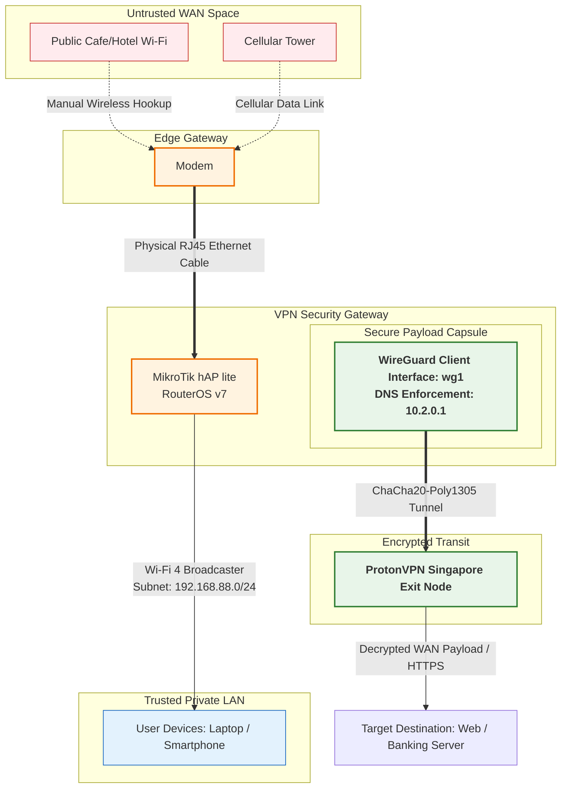

# Mikrotik-Travel-Router
An Ultra-budget travel router featuring automatic network switching and Wireguard VPN esuring privacy

(Insert Prototype Photo Here)

## Materials
### Hardware
* **Modem with Data, Wifi Capabilities and has a LAN port** (In my case i used a burner phone)
* **Mikrotik Hap Lite** (Any Mikrotik hap series will do as long as it runs RouterOS v7 and Wi-Fi capabilites. Used for WireGuard encryption)
* **Any Standard 5V Power Bank**
* **1x Ethernet Cable** (Connects from modem to the Mikrotik)
*  **1x Micro USB** (For my case, adjust if needed)

### Software
* **WinBox Application** (To access the Mikrotik's Configuration)
*  **Proton VPN serivce** (Any VPN service will do as long as it supports generationg a WireGuard config file `.conf `)

## Thought Proccess
### Problem
- **The Data Problem:** Cellular data is costly and sometimes unrelaible in remote areas with signals dropping segnificantly more. However, modern daily life requires constant connectivity to the interent
- **The First Step:** This setup solves the data costs by offloading network trafic to public wifi under the users consent
- **The Security Problem:** Connecting to public hotpsot is highly insecure, leaving you vunerable to network sniffing and cyber threats.
- **Risk Factors:** Accessing highly confidential systems such as mobile banking or personal accounts over an open network exposes private credentials to anyone listening

### Solution:
- **Hardware-Level Encryption:** To eliminate security concerns, this project utilizes a lightweight WireGuard VPN embedded at router level
- **Complete Privacy:** It turns an open network into a secure tunel, making data transfered on the local network compeletely unreadable to network sniffer, Protecting your digital footprints and data privvacy across the internet.

###  Project Comparison: Custom Architecture vs. Alternatives

| Feature |  Phone Hotspot + VPN |  Popular GL.iNet Routers  *(Beryl AX, Slate AX, Mango)* |  This Project  *(Modem + MikroTik hAP lite)* |
| :--- | :--- | :--- | :--- |
| **Approx. Cost** | Free (Uses current phone) | \$40 - \$120+ | **~\$20** (Using entry-level or legacy hardware) |
| **Power Input** | Severe phone battery drain | 5V USB-C | **5V Micro-USB** (Highly efficient via standard power bank) |
| **Cellular Data** | Built-in | **None**  *(Requires buying separate expensive USB dongles or modems)* | **Built-in via a Modem** |
| **Wi-Fi Generation** | Wi-Fi 5 / 6 | Wi-Fi 6 | ⚠️ **Wi-Fi 4 (802.11n)**  *(Hardware limitation)* |
| **Network Switching** | Manual | Manual / Repeater mode | **Manual**  *(User switches Modem between public Wi-Fi & cellular)* |
| **VPN Performance** | Fast (Relies on phone CPU) | Fast (Dedicated crypto processors) | ⚠️ **Max ~30 Mbps**  *(Limited by MikroTik's 650MHz CPU)* |

## Network Topology

## Configuration
### Generating a free WireGuard Configuration Using ProtonVPN
* Open [ProtonVPN's Website](protonvpn.com) and Register/Signin to your Account
* On your Account page, Click the **Downlads Button** as shown and scroll down to find the **Wireguard Configuration** Section
* Copy the options as shown in the Image. You can fill the **Device/Certificate Name** to whatever you like

* Once done, you should be able to download the WireGuard Configuration File

### Mikrotik's Configuration
* Open the [WinBox](https://mikrotik.com/download/winbox) Application
* Plug in the ethernet cable to the mikrotik's LAN port to the Computer
* On Winbox, Login to the Router using the **MAC Address** then go to **System -> Reset Configuration** reset it with **No Default Configuration** ticked
* Once the router is rebooted, Login to the Router's configuration with Winbox and Click **New Terminal**
