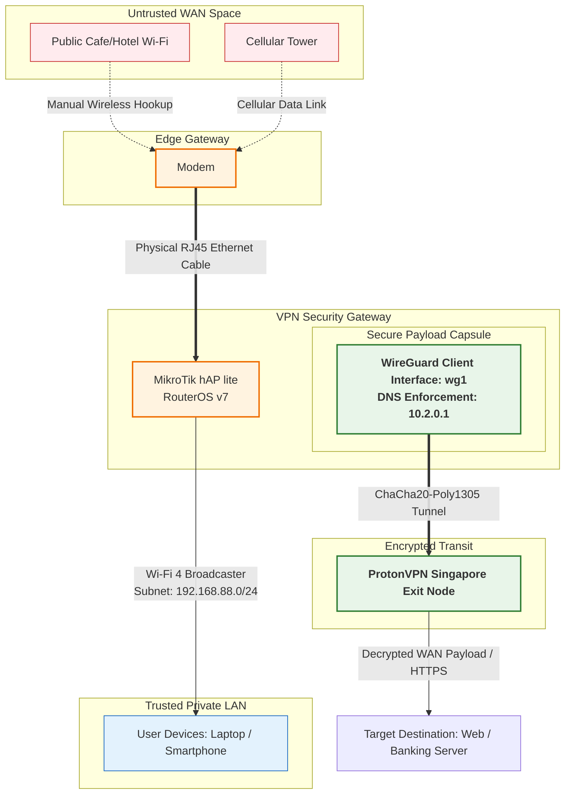

# Mikrotik-Travel-Router
An Ultra-budget travel router featuring automatic network switching and Wireguard VPN esuring privacy

(Insert Prototype Photo Here)

### Features
- [x] Connects to Public WIFI via users command
- [x] Failovers to a Cellular Connection if Public WIFI is unavailable
- [x] Handles WireGuard VPN connection Up To 30Mbps
- [x] Broadcasts secure WIFI Connection up to 5 Devices
- [x] Disconnects to Network Automatically when WireGuard VPN Fails

## Materials
### Hardware
* **Modem with Data, Wifi Capabilities and has a LAN port** (In my case i used a burner phone)
* **Mikrotik Hap Lite** (Any Mikrotik hap series will do as long as it runs RouterOS v7 and Wi-Fi capabilites. Used for WireGuard encryption)
* **Any Standard 5V Power Bank**
* **1x Ethernet Cable** (Connects from modem to the Mikrotik)
*  **1x Micro USB** (For my case, adjust if needed)

### Software
* **WinBox Application** (To access the Mikrotik's Configuration)
*  **Proton VPN serivce** (Any VPN service will do as long as it supports generationg a WireGuard config file `.conf `)

## Thought Proccess
### Problem
- **The Data Problem:** Cellular data is costly and sometimes unrelaible in remote areas with signals dropping segnificantly more. However, modern daily life requires constant connectivity to the interent
- **The First Step:** This setup solves the data costs by offloading network trafic to public wifi under the users consent
- **The Security Problem:** Connecting to public hotpsot is highly insecure, leaving you vunerable to network sniffing and cyber threats.
- **Risk Factors:** Accessing highly confidential systems such as mobile banking or personal accounts over an open network exposes private credentials to anyone listening

### Solution:
- **Hardware-Level Encryption:** To eliminate security concerns, this project utilizes a lightweight WireGuard VPN embedded at router level
- **Complete Privacy:** It turns an open network into a secure tunel, making data transfered on the local network compeletely unreadable to network sniffer, Protecting your digital footprints and data privvacy across the internet.

###  Project Comparison: Custom Architecture vs. Alternatives

| Feature |  Phone Hotspot + VPN |  Popular GL.iNet Routers <br>*(Beryl AX, Slate AX, Mango)* |  This Project <br>*(Modem + MikroTik hAP lite)* |
| :--- | :--- | :--- | :--- |
| **Approx. Cost** | Free (Uses current phone) | \$40 - \$120+ | **~\$20** (Using entry-level or legacy hardware) |
| **Power Input** | Severe phone battery drain | 5V USB-C | **5V Micro-USB** (Highly efficient via standard power bank) |
| **Cellular Data** | Built-in | **None** <br>*(Requires buying separate expensive USB dongles or modems)* | **Built-in via a Modem** |
| **Wi-Fi Generation** | Wi-Fi 5 / 6 | Wi-Fi 6 | ⚠️ **Wi-Fi 4 (802.11n)** <br>*(Hardware limitation)* |
| **Network Switching** | Manual | Manual / Repeater mode | **Manual** <br>*(User switches Modem between public Wi-Fi & cellular)* |
| **VPN Performance** | Fast (Relies on phone CPU) | Fast (Dedicated crypto processors) | ⚠️ **Max ~30 Mbps** <br>*(Limited by MikroTik's 650MHz CPU)* |

## Network Topology



## Configuration
### Generating a free WireGuard Configuration Using ProtonVPN
* Open [ProtonVPN's Website](protonvpn.com) and Register/Signin to your Account
* On your Account page, Click the **Downlads Button** as shown and scroll down to find the **Wireguard Configuration** Section
* Copy the options as shown in the Image. You can fill the **Device/Certificate Name** to whatever you like


* Once done, you should be able to download the WireGuard Configuration File

### Mikrotik's Configuration
* Open the [WinBox](https://mikrotik.com/download/winbox) Application
* Plug in the ethernet cable to the mikrotik's LAN port to the Computer
* On Winbox, Login to the Router using the **MAC Address** then go to **System -> Reset Configuration** reset it with **No Default Configuration** ticked
* Once the router is rebooted, Login to the Router's configuration with Winbox and Click **New Terminal**
* View The Script [Here](scripts/Mikrotik-Conifg.rsc) Or see it Directly

```routeros
# ==============================================================================
# MikroTik RouterOS V7 Config
# ==============================================================================
# For MikroTik hAP lite (SMIPS) / Clean Slate (No Default Configuration)
# Topology: ether1 (WAN Ingress from Modem) | ether2-4 + wlan1 (Local Bridge)

# ------------------------------------------------------------------------------
# Local Bridge Configuration
# ------------------------------------------------------------------------------
# Create a unified Layer 2 bridge domain for all local trusted assets
/interface bridge add name=bridge-local comment="Unified LAN/WLAN Bridge Switch"

# Bind physical interfaces ether2, ether3, and ether4 to the trusted switch
/interface bridge port
add bridge=bridge-local interface=ether2
add bridge=bridge-local interface=ether3
add bridge=bridge-local interface=ether4

# ------------------------------------------------------------------------------
# 2. Wifi Hotspot/Broadcast Wifi
# ------------------------------------------------------------------------------
# Define cryptographic parameters for local Wi-Fi connection
/interface wireless security-profiles
add name=travel-vault-profile \
    mode=dynamic-keys \
    authentication-types=wpa2-psk \
    wpa2-pre-shared-key="YOUR_ROUTER_WIFI_PASSWORD"

# Configure the 2.4GHz internal radio to broadcast the secure SSID
/interface wireless
set [ find default-name=wlan1 ] \
    mode=ap-bridge \
    ssid="YOUR_SECURE_TRAVEL_SSID" \
    security-profile=travel-vault-profile \
    band=2ghz-b/g/n \
    frequency=auto \
    installation=indoor \
    disabled=no

# Bind the radio asset to our trusted local switch domain
/interface bridge port add bridge=bridge-local interface=wlan1

# ------------------------------------------------------------------------------
# 3. Lan IP & DHCP Server
# ------------------------------------------------------------------------------
# Assign local gateway residency to the bridge interface
/ip address add address=192.168.88.1/24 interface=bridge-local

# Construct the local client IP address pool
/ip pool add name=dhcp-pool-local ranges=192.168.88.10-192.168.88.254

# Instantiate and bind the DHCP network server engine
/ip dhcp-server add name=dhcp-lan-server interface=bridge-local address-pool=dhcp-pool-local disabled=no

# Configure distributed DHCP leases to point DNS inside the VPN tunnel endpoint 
# to structurally eliminate DNS leaks at the local node level.
/ip dhcp-server network add address=192.168.88.0/24 gateway=192.168.88.1 dns-server=10.2.0.1 comment="Enforce Inner-Tunnel DNS Engine"

# ------------------------------------------------------------------------------
# 4. WAN Configuration via Modem Connection
# ------------------------------------------------------------------------------
# Listen on ether1 for incoming DHCP configuration vectors served by the Orbit
/ip dhcp-client add interface=ether1 use-peer-dns=yes use-peer-ntp=yes disabled=no comment="Ingress from Modem"

# ------------------------------------------------------------------------------
# 5. WireGuard VPN Setup
# ------------------------------------------------------------------------------
# Initialize the stateful native WireGuard interface
/interface wireguard add listen-port=51820 name=wg-proton private-key="YOUR_VPN_PRIVATE_KEY"

# Allocate the explicit inside-tunnel address given by the provider
/ip address add address=10.2.0.2/24 interface=wg-proton network=10.2.0.0

# Register the cryptographic endpoint signature of the upstream exit node
/interface wireguard peers
add interface=wg-proton \
    public-key="SERVER_VPN_PUBLIC_KEY" \
    endpoint-address=SG_SERVER_IP_OR_HOSTNAME \
    endpoint-port=51820 \
    allowed-address=0.0.0.0/0 \
    persistent-keepalive=25s \
    comment="Primary Cryptographic Gateway Node"

# ------------------------------------------------------------------------------
# 6. Policy Routing & Tunnel Enforcement (RouterOS v7 Format)
# ------------------------------------------------------------------------------
# Provision a dedicated routing data table structure inside the kernel
/routing table add name=tunnel-delivery-table fib

# Bind a complete universal destination path out through the WireGuard pipe inside that specific table
/ip route add dst-address=0.0.0.0/0 gateway=wg-proton routing-table=tunnel-delivery-table

# Build a structural hard Kill Switch: if the tunnel breaks down, drop packets 
# into a blackhole instead of passing them unsecured through the local ISP/Orbit gateway.
/ip route add dst-address=0.0.0.0/0 type=blackhole routing-table=tunnel-delivery-table distance=10

# Direct all traffic entering from our local address matrix to evaluate using the VPN table
/routing rule add src-address=192.168.88.0/24 action=lookup table=tunnel-delivery-table

# ------------------------------------------------------------------------------
# 7. NAT & MSS Clamping
# ------------------------------------------------------------------------------
# Hide local address scope behind inside-tunnel IP representation
/ip firewall nat add chain=srcnat out-interface=wg-proton action=masquerade comment="Masquerade VPN Traffic"

# Keep an alternative fallback masquerade rule for local management data escaping on WAN interface
/ip firewall nat add chain=srcnat out-interface=ether1 action=masquerade comment="Masquerade WAN Failover"

# Clamp MSS over VPN to account for cryptographic payload headers over standard ISP 1500-byte frame structures
/ip firewall mangle
add chain=forward action=change-mss new-mss=clamp-to-pmtu passthrough=yes protocol=tcp tcp-flags=syn out-interface=wg-proton comment="Prevent MTU Fragment Collisions"
